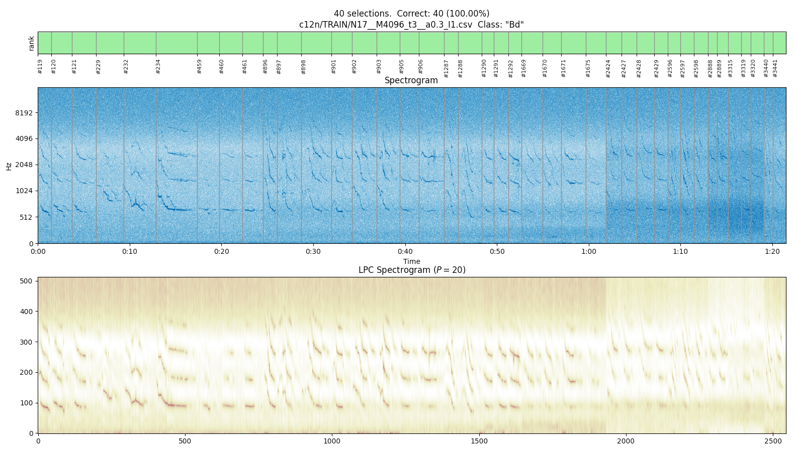
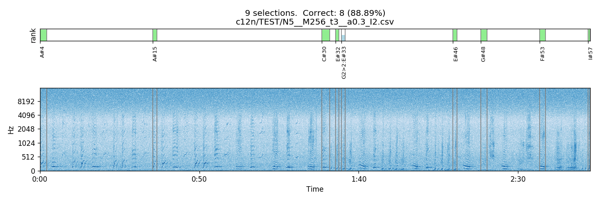

2020-11

- warning if hmm model trained with sequence of different class name
- 0.6.1 introduce SeqProvider as preparation to then be able to specify
  predictors for classification 
    - complete dispatching predictors for HMM classification 
  
- fix conflicting loop variable name `i` in `hmm_classify`, used 
  when ordering candidates in a mis-classification, but messing up
  the outer `i` variable used to loop over the sequences.
 
- 0.6.0 preliminaries for `ecoz2_hmm_classify_predictors`

- 0.5.5 set `double` as default `prob_t`

- 0.5.5 increase MAX_PREDICTION_ORDER to 200
- 0.5.4 verbose option of lpc analysis
- 0.5.2 increase MAX_PREDICTION_ORDER to 70

- add sgn.plot.spec.py.
  As used elsewhere:
  
        sgn.plot.spec.py --lpc 20 \
            --signal ../MARS_20161221_000046_SongSession_16kHz_HPF5Hz.wav \
            --segments ../exerc01/MARS_20161221_000046_SongSession_16kHz_HPF5HzNorm_labels.csv \
            --selection 55 21-22  \
          --out-prefix=../../ecoz2/src/py/

2020-10

- 0.5.1: display `sizeof(prob_t)` in hmm_learn
- 0.5.0: allow to indicate `prob_t` type via `#define PROB_T`

2020-08

- matplotlib.use('macosx') so final fig.savefig completes ok on my mac

- add `--cmap cm` option to c12n.plot.py to override default color map in spectra plots
- add `--lpc P` option to c12n.plot.py to generate LPC spectra plot
  along with the regular spectrogram

    Example (under `ecoz2-whale/exerc02`):

        $ c12n.plot.py --concat --class Bd --lpc 36 \
            --signal ../MARS_20161221_000046_SongSession_16kHz_HPF5Hz.wav \
            --segments ../exerc01/MARS_20161221_000046_SongSession_16kHz_HPF5HzNorm_labels.csv \
            --c12n c12n/TRAIN/N17__M4096_t3__a0.3_I1.csv   \
            --out-prefix c12n/TRAIN/

    

2020-07-31

- Reset my local dev environment since usual build was not working upon
  some various OS upgrades.

    In short:

    - Re-install XCode (11.6) and then `xcode-select --install`
    - Upgrade gcc `brew upgrade gcc`
    - update path: `export PATH=/usr/local/Cellar/gcc/10.1.0/bin:$PATH`
    - back to a successful complete build: `CC=gcc-10 make`

2020-05

- add c12n.plot.py to plot classification results

        $ c12n.plot.py -h
        usage: c12n.plot.py [-h] [--signal wav] [--max-seconds secs] [--concat]
                            [--cover] --segments file --c12n secs [--rank rank]
                            [--class name] [--msfd number] [--out-prefix prefix]
        
        Plot classification results
        
        optional arguments:
          -h, --help           show this help message and exit
          --signal wav         Associated sound file (spectrogram of which is shown).
          --max-seconds secs   Max seconds to visualize
          --concat             Concatenate given selections all together
          --cover              Show interval covered by the selections
          --segments file      CSV file with segments.
          --c12n secs          CSV file with classification results.
          --rank rank          Only dispatch given rank
          --class name         Only dispatch given class
          --msfd number        Maximum number of selections for detailed plot (default 100)
          --out-prefix prefix  Prefix to name output plot file.

    Example in ecoz2-whale/exerc03b:

        c12n.plot.py --concat --class C \
            --signal ../../ecoz2-whale/MARS_20161221_000046_SongSession_16kHz_HPF5Hz.wav \
            --segments ../exerc01/MARS_20161221_000046_SongSession_16kHz_HPF5HzNorm_labels.csv \
            --c12n c12n/TEST/N5__M256_t3__a0.3_I2.csv   \
            --out-prefix c12n/TEST/

      

        c12n.plot.py --cover  \
            --signal ../../ecoz2-whale/MARS_20161221_000046_SongSession_16kHz_HPF5Hz.wav \
            --segments ../exerc01/MARS_20161221_000046_SongSession_16kHz_HPF5HzNorm_labels.csv \
            --c12n c12n/TEST/N5__M256_t3__a0.3_I2.csv   \
            --out-prefix c12n/TEST/      

      

- 0.4.4, hmm_classify: option to generate classification results file.
  Example:

        # num_models=18  M=1024  num_seqs=2004
        seq_filename,                      seq_class_name, correct, rank, r1, r2,...
        data/sequences/M1024/A/00003.seq,  A,              *,       1,    A,  ...
        data/sequences/M1024/Bd/00119.seq, Bd,             !,       2,    C,  Bd, ...

       - `rank` is the rank of the correct model (so `*,1` should always appear together).
       - `r1, ..., r<num-models>` show all models (class name) in decreasing probability order

    Note: rank now shown starting from 1 (not 0).

- 0.4.3, report actually used random seed to facilitate reproducibility
- 0.4.2, report csv with (iteration, Σ log(P)) in hmm_learn
- 0.4.0, with minor adjs
- use a get_seed depending on os
- minor distribution related adjustments

- 0.3.5 - release using github actions (linux and macos binaries)

- include callback_target in vq learn functions

- increase max codebook size to 4096.
  For now, just increasing stack size for associated arrays.
  TODO use heap.
- 0.3.3 add ecoz2_vq_learn_using_base_codebook

- vq.learn: add ability to start from a given codebook

        vq.learn [options] <predictor> ...
    
        -B <codebook>   Start training from this base codebook.
        -P <val>        Prediction order (required if -B not given).
        -w <id>         Class ID to associate to generated codebooks.
        -e <val>        Epsilon parameter for convergence (0.05, by default).
        -s <val>        Seed for random numbers. Negative means random seed (-1, by default).
        -S              Use serialized impl (parallel impl, by default).
        <predictor>...  training predictor files

- interesting: https://doi.org/10.1155/2017/7318940
  "Efficient and Effective Learning of HMMs Based on Identification of Hidden States"
  Liu and Lemeire (2017).

- minor adjs in hmm_estimateB

- _classify: show average accuracy and error rate

- hmm.learn: make it run serialized by default as we assume the general
  setting of multiple models being ("externally") trained in parallel.

- hmm_refinement: more revision

    - reestimate_A/B (renamed from refine_A/B).
    - precompute `log(A[i][j])` and `log(B[j][O[t]])` as suggested in Rabiner (1989)

- hmm_refinement: adjustments to more closely reflect description in papers
  (Stamp, 2018; Rabiner, 1989).
  TODO: review hmm_log_prob.c as well

- some various adjustments and extra logging while running hmm_learn
  in various training exercises. In particular, one with N=160, M=512
  and 370 sequences ('I' whale song unit), generated some nan probabilities
  during the training eventually making it get stuck.
  For now, I put some "correction" in refine_A and refine_B to handle
  zero denominators calculated from previous steps.  TODO continue revision

- interesting: https://gcc.gnu.org/onlinedocs/gcc/Loop-Specific-Pragmas.html#Loop-Specific-Pragmas

- note: Although there's surely ample room for (internal) performance
  improvements in hmm_learn, this is not a priority especially given
  that, in general, multiple models will typically be trained concurrently,
  and this can be done efficiently via a "external" tool like
  [parallel](https://www.gnu.org/software/parallel/).

- some profiling using gperftools

    - on Mac: `brew install gperftools; PATH=/usr/local/Cellar/gperftools/2.7/bin:$PATH`
    - Add -lprofiler in x/Makefile and re-make the programs
    - Run a program, eg:

            $ CPUPROFILE=hmm.learn.prof hmm.learn -s 0 -N 128 -a 0.3 .../*.seq
            $ pprof --text `which hmm.learn` hmm.learn.prof

                4780  81.4%  81.4%     4783  81.4% _hmm_learn
                 441   7.5%  88.9%      656  11.2% _hmm_log_prob
                 396   6.7%  95.6%      396   6.7% _hmm_genQopt_with_mem
                 187   3.2%  98.8%      187   3.2% 0x00007fff51e5a15a
                  30   0.5%  99.3%       30   0.5% 0x00007fff51e4fdc2
                  10   0.2%  99.5%       10   0.2% 0x00007fff51e58e66
                   9   0.2%  99.6%        9   0.2% 0x00007fff51e58e7e
                   5   0.1%  99.7%        5   0.1% 0x00007fff51e595aa
                   4   0.1%  99.8%        4   0.1% 0x00007fff51f8dc69
                   3   0.1%  99.8%        3   0.1% _hmm_precompute_logB
                   2   0.0%  99.9%        2   0.0% _hmm_adjustB
                   1   0.0%  99.9%        1   0.0% 0x0000000111c4fa49
                   1   0.0%  99.9%        1   0.0% 0x00007fff51e5970a
                   1   0.0%  99.9%        1   0.0% 0x00007fff51eb32eb
                   1   0.0%  99.9%        1   0.0% 0x00007fff51ebf1d7
                   1   0.0% 100.0%        1   0.0% 0x00007fff51ebf3be
                   1   0.0% 100.0%        1   0.0% 0x00007fff51f8dc94
                   1   0.0% 100.0%        1   0.0% _hmm_genQopt
                   ...

      some previous run:

            Using local file .../_out/bin/hmm.learn.
            Using local file hmm.learn.prof.
            Total: 606 samples
            374  61.7%  61.7%      378  62.4% _hmm_learn
            197  32.5%  94.2%      197  32.5% _hmm_genQopt_with_mem
             23   3.8%  98.0%       30   5.0% _hmm_log_prob
              7   1.2%  99.2%        7   1.2% 0x00007fff51e5a15a
            ...

- revert to use hmm_log_prob in seq_show_files (for simplicity)

- some `hmm_learn` revision
- new option `-S` for `hmm.learn` to use the serialized impl.

- ecoz2_set_random_seed: use srand(rand()) instead of sranddev()
  to facilitate build on macos and linux

- parallelize `hmm_classify`.
  This is only done in the inner loop that gets the R probabilities
  for each sequence, where R is the number of models.
  The current loop structure is basically: foreach-sequence: foreach-model.
  TODO switching these loops might be even more performant.

    Results with the following involving 20 64/2048 HMMs and 1060 sequences:
      PAR: 4.24s;  SER: 13.66s => >3x speedup

        $ hmm.classify data/hmms/N64__M2048_t3__a0.3/*hmm  data/sequences/TEST/M2048/*/*seq

- minor hmm_learn code reorg

- `seq_show`: show size of sequence and abbreviate it with `...` if
  if a bit too many: `<(size): s, s, s, ..., s, s, s>`

- `vq_learn` code reorganized to incorporate parallel impl:

    - some common support routines put in a separate vq_learn.i
    - vq_learn_ser.c with serialized version
    - vq_learn_par.c with parallel version
    - add option `-S` to indicate serialized impl (by default, parallel)
    - TODO similar -S option for `lpc`

- Results with initial parallelized version of `vq_learn`:
    PAR: ~207s;  SER: ~634s.

        $ vq.learn [-S] -P 36 -e 0.0005 data/predictors/data/MARS_20161221_000046_SongSession_16kHz_HPF5Hz.prd

2020-04

- `vq_learn`: measure processing time, globally and per codebook size
- add `-s <seed>` option to `vq.learn`

- measuring actual processing (CLOCK_REALTIME) time (ie, excluding file
  loading and other stuff), here's the updated results with lpc on the
  4.5 hr signal, on my mac (3.1 GHz Intel Core i7):
     PAR: ~1.8s; SER: ~10-12s,
     so a >5x speedup.

        $ lpc -X 0 -P 36 -W 45 -O 15 .../MARS_20161221_000046_SongSession_16kHz_HPF5Hz.wav
        Number of classes: 1
        class 'data': 1
          .../MARS_20161221_000046_SongSession_16kHz_HPF5Hz.wav
        lpa_on_signal: P=36 numSamples=266117287 sampleRate=16000 winSize=720 offset=240 T=1108820
        (desired_threads=8 actual_threads=8)
          1108820 total frames processed
        processing took 1.77s
        data/predictors/data/MARS_20161221_000046_SongSession_16kHz_HPF5Hz.prd: 'data': predictor saved

- use `-march=native`.
  Note: a strict binary comparison (via `cmp`) showed difference against
  previously generated `.prd` file with no such option. However, a
  comparison based on the output of `prd.show`, which uses `"%.5f"` as
  format for the values, showed no differences at all.

- initial parallelized version of lpa_on_signal using openmp.
  This is for now conditioned by a PAR define in the source.

- some makefile and code adjustments while compiling with
  gcc (Homebrew GCC 9.3.0_1) FSF

- use HmmProb is seq_show_files

- add `-s <seed>` option to `hmm.learn`

- rename to lpa_on_signal
- expose lpca as ecoz2_lpca
- some additions/adjs to facilitate comparison with rust output

- preliminary vq_learn_callback_t
  reporting (M, avgDistortion, sigma, inertia) for each codebook size
- expose ecoz2_set_random_seed
- expose other main functions for wrapping purposes.
  All with `ecoz2_` prefix, and wrappers to include only ecoz2.h

- new HmmProb struct and functions to improve performance of
  multiple log_prob calculation wrt to same model
  Used in hmm_classify

- preliminary hmm_learn_callback_t

2020-03

- preps to facilitate python binding

- vq.classify: extract main function into library

- seq.show: extract main function into library

- prd.show: extract main function into library

- lpc: extract main function into library

- rename cb.show to vq.show and extract main function into library

- hmm.show: extract main function into library

- remove some warnings as reported in rust project

- hmm.classify: extract main function into library

- hmm.learn: extract main function into library.
  NOTE: I had a bug before: was skipping the first given sequence!

- vq.quantize: extract main function into library

2019-09

- add `--plot` option to `sgn.select.py` to generate plot of spectrogram
  in given signal interval, as well as codewords (using basic color mapping), 
  and distortion in corresponding given csv file.
- add `sgn.select.py` utility

- vq.learn: allocate some stuff on the heap to allow bigger input data 
- vq.learn: extract main function into library 

- vq.learn: report codeword and minimum distortion for each training vector against
  each generated codebook
- `cb.plot_cell_shapes.py` utility to display the above info
  
- additions/adjustments for more organized codebook evaluation report.
  
    Let's do a complete exercise starting from a single sound file.
     
    Setup: 
    
        $ make
        $ export PATH=`pwd`/_out/bin:$PATH
        $ export PATH=`pwd`/src/py:$PATH
        $ pip install pandas matplotlib  # optional: for plotting
        
    Assuming `HBSe_20161221T010133.wav` in some directory:
    
        $ cd <some-directory>
        $ lpc -P 36 -W 45 -O 15 HBSe_20161221T010133.wav
        Number of classes: 1
        class '': 1
          HBSe_20161221T010133.wav
        lpa_on_signal: P=36 numSamples=18368474 sampleRate=32000 winSize=1440 offset=480 T=38265
        data/predictors/_/HBSe_20161221T010133.prd: '': predictor saved
        
    This generates a single predictor file. Usually a predictor file is associated
    with a single vocalization (a human spoken word or a whale song unit), but in
    this case we are just interested in aggregating a set of LPC vectors from a large
    sound file for purposes of the clustering exercise.
    
    Let's generate the codebooks:
    
        $ vq.learn -P 36 -e 0.0005 data/predictors/_/HBSe_20161221T010133.prd
    
    `vq.learn` now also generates various `.csv` files, one for the overall evaluation
    `eps_0.0005.rpt.csv` and one per codebook size with cardinalities and distortions:
    
        $ ls data/codebooks/_
        eps_0.0005.rpt
        eps_0.0005.rpt.csv
        eps_0.0005_M_0002.cbook
        eps_0.0005_M_0002.cbook.cards_dists.csv
        eps_0.0005_M_0004.cbook
        eps_0.0005_M_0004.cbook.cards_dists.csv
        eps_0.0005_M_0008.cbook
        eps_0.0005_M_0008.cbook.cards_dists.csv
        eps_0.0005_M_0016.cbook
        eps_0.0005_M_0016.cbook.cards_dists.csv
        eps_0.0005_M_0032.cbook
        eps_0.0005_M_0032.cbook.cards_dists.csv
        eps_0.0005_M_0064.cbook
        eps_0.0005_M_0064.cbook.cards_dists.csv
        eps_0.0005_M_0128.cbook
        eps_0.0005_M_0128.cbook.cards_dists.csv
        eps_0.0005_M_0256.cbook
        eps_0.0005_M_0256.cbook.cards_dists.csv
        eps_0.0005_M_0512.cbook
        eps_0.0005_M_0512.cbook.cards_dists.csv
        eps_0.0005_M_1024.cbook
        eps_0.0005_M_1024.cbook.cards_dists.csv
        eps_0.0005_M_2048.cbook
        eps_0.0005_M_2048.cbook.cards_dists.csv
    
    Let's plot the general evaluation:
    
        $ data/codebooks/_/eps_0.0005.rpt.csv
               M  passes     DDprm          σ       inertia
        0      2       7  0.329847   1.669760  85563.055636
        1      4      19  0.258477   3.662945  67812.819378
        2      8      26  0.198647   7.851806  58449.267547
        3     16      32  0.157429  11.032102  52835.579481
        4     32      16  0.130626  15.396460  49804.951420
        5     64      17  0.110648  20.375099  47672.295169
        6    128      17  0.096532  24.747489  46300.641095
        7    256      16  0.084483  30.756691  45173.663627
        8    512      15  0.074696  36.942795  44299.052234
        9   1024      14  0.065547  43.420272  43505.964302
        10  2048      12  0.056605  51.227322  42754.019571
        
    This generates `cb_evaluation.png`.
    
    Let's plot the cardinalities and distortions for M=1024:
    
        $ cb.plot_cards_dists.py data/codebooks/_/eps_0.0005_M_1024.cbook.cards_dists.csv
        
    This generates `cb_cards_dists.png`.
    
    Now, let's extract the k_1, k_2, and k_3 reflection coefficients from the
    training vectors:
    
        $ prd.show -k -r 1-3 data/predictors/_/HBSe_20161221T010133.prd > data/predictors/_/HBSe_20161221T010133.prd.kkk.csv
        $ head data/predictors/_/HBSe_20161221T010133.prd.kkk.csv
        # data/predictors/_/HBSe_20161221T010133.prd:
        # className='', T=38265, P=36
        k1,k2,k3
        -0.13743,0.321453,-0.112715
        -0.103927,0.320109,-0.137698
        -0.136486,0.322977,-0.0785831
        -0.160965,0.327485,-0.147224
        -0.127233,0.264571,-0.181007
        -0.144313,0.370183,-0.135964
        -0.0980965,0.411245,-0.101035 
    
    and also from the codebooks, say from the M=1024 codebook:

        $ cb.show -r 1-3 data/codebooks/_/eps_0.0005_M_1024.cbook > data/codebooks/_/eps_0.0005_M_1024.cbook.kkk.csv
        $ head data/codebooks/_/eps_0.0005_M_1024.cbook.kkk.csv
        # data/codebooks/_/eps_0.0005_M_1024.cbook:
        # P=36  size=1024  className='_'
        k1,k2,k3
        -0.76091,-0.0986296,-0.407168
        -0.719444,-0.0847496,-0.43053
        -0.70288,-0.0588205,-0.38793
        -0.706682,-0.00428451,-0.376763
        -0.537687,0.0408431,-0.333315
        -0.542176,0.0610915,-0.350283
        -0.609534,-8.40823e-05,-0.372286
        
    With the above set of reflection coefficients, let's do a "k_1 vs. k_2 vs. and k_3"
    scatter plot to visualize the clusters:
    
        $ cb.plot_reflections.py data/predictors/_/HBSe_20161221T010133.prd.kkk.csv data/codebooks/_/eps_0.0005_M_1024.cbook.kkk.csv
        df_training points = 38265
        df_training plotted points = 8000
        df_codebook points = 1024
 
    This generates `cb_kkk_training_8000_codebook_1024.png`. 
    
- add inertia calculation
- prd.show/cb.show: allow for coefficient range selection and generate csv

2018-09-27

- complete first general revision over selected parts of
  my original "ECOZ" implementation of 1993.
